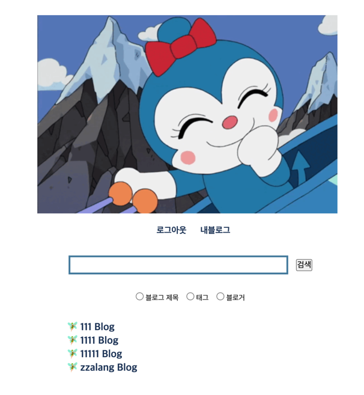
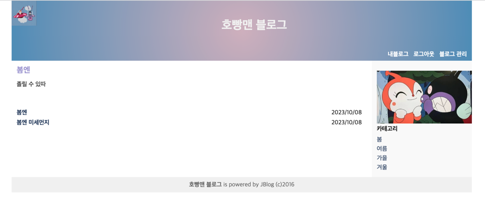

#####  README.md Draft...
<h1 align="center"> jblog03 </h1>
<!-- <h3 align="center"> A Comparative Study between Different Pre-processing Approaches and Classifiers </h3>  
 -->


## 목차

[1.:pencil: 프로젝트 개요](#프로젝트 개요)      
[2.🍃 spring 나만의 wa-ggu 정리](#spring 나만의 wa-ggu 정리)      
[3.🗒️IoC Container ConfigurationBean Configuration](#IoC Container Configuration Bean Configuration)      
[4.번외 멍청일기](#번외 멍청일기)   
[5.📂 파일 구조](#파일 구조)   


   





## :pencil: 프로젝트 개요
### 서비스 설명
- spring 프레임워크를 활용한 블로그 서비스 개발


### 서비스 기능
- 회원가입 / 로그인
- 블로그 포스팅
- 블로그 관리(admin)
- ...
 
   
## 🛠️ 구현 과정
### DB 설계
> 
+ 위 구조에서 POST 테이블에 reg_Date 추가

### 회원 기능
- UserController / UserService / UserRepository / User.xml (query)

  요구사항          | UserController           | UserService                            | UserRepo |
    --------------|--------------------------|----------------------------------------|----------
  회원가입          | join                     | join  > **DuplicateIdException 중복id** 예외처리 | insert 
  로그인            | login > LoginIntercepter |                                        |
  로그아웃           | LogoutIntercepter        
  블로그 생성   |

#### auth 설정
- 스프링 시큐리티의 간단한 동작 과정
  1. 스프링 시큐리티는 Role에 따른 url 접근 제어를 기본으로 합니다.
  2. WebSecurityConfigurerAdapter 을 상속받은  security config 객체에서 각 url 에 요구되는 role을 기술합니다.
  3. security config 객체에서는 원하는 url 에 원하는 filter를 걸 수 있습니다.
  4. 다수의 url 에 다수의 filter 를 걸 수 있습니다.
  5. 특정 url 에 접근하려는 user는 url 걸려있는 필터를 통과해야하며, 모든 필터를 통과한 유저는 인증된 사용자로서 SecurityContext 에 저장됩니다.
- Spring Security Architecture
  - Authentication (인증)
    - 인터페이스 : AuthenticationManager -> AuthenticationProvider
  - Authorization (인가)

#### Interceptor

### 블로그 기능
- main 화면

  요구사항          | MainController          | UserService | UserRepo |
  ----------------|-------------------------|------------|----------
  유저 리스트 노출     | main                   |   getUsers         |getUsers() > SELECT


- admin 화면

  요구사항          | BlogController      | BlogService | BlogRepo |
    --------------|---------------------|-------------|----------
  권한 설정          | Interceptor         |              |
  블로그 정보 보여주기 | adminBasic          |     
  블로그 정보 업데이트 | adminBasic          | adminBasicUpdate  |updateBasic >UPDATE
  파일 업로드 | adminBasic (MultipartFile) |**fileUploadService** ->exception 처리
  카데고리 리스트 | adminCategory       
  카테고리 추가 | adminCategory       |
  카테고리 삭제| adminCategoryDelete | |
  글 작성 | adminWrite          ||

- post 화면

  요구사항          | BlogController | BlogService | BlogRepo |
    ----------------|-------------|-------------|----------
  게시글 메인     | index       |             |
  게시글 리스트 </br> (최신 순으로 정렬)   | index       |             |
  카테고리 리스트 | index       |             |

#### 

### etc.
#### 로그 설정
- logback.xml


## 🍃 spring 나만의 wa-ggu 정리

### MVC 구조

MVC          |  description
-------------|----------------------------------------------------------------------
Controller   |  웹 브라우저의 req을 받음 -> req param 바인딩, 검증, res화면, res화면에 담을 model 결정 
Service      |  비즈니스 로직 수행, 트랜잭션 경계 설정, 접근 권한 확인
Repository   |  데이터 저장 및 조회
- 객체지향 분석 설계 원칙 중 '단일 책임 원칙'
***
### e.g. member 모듈
1. 사용자가 웹 브라우저에 **http:localhost:8080/member/list** URL 입력
2. 이 req는 /로 시작 -> local에서 Tomcat을 사용해 실행 -> web.xml에 등록한 DS가 처리
3. DS는 **/member/list**를 보고, MemberController가 이 req를 처리해야 함을 catch
4. MemberController는 MemberService를 사용해서 회원 목록 req
5. MemberService는 MemberRep를 사용해서 DB에 있는 회원 목록 조회
***
### 개발 전 설정
#### 0. maven 설정
- pom.xml : 메이븐 설정 파일
  - 기본 정보, 의존성(dependency), 저장소, 빌드 정보, 플러그인 정보 설정  
#### 1. DispatcherServlet 설정
- web.xml


settings               |  description                                                     
-----------------------|--------------------------------------------------------------------------------------------------------
서블릿 이름 설정           |  `<servlet> <servlet-name>...<serlvet-class>... </servlet>` </br> -> web/WEB-INF에 "서블릿 이름"-servlet.xml 파일을 스프링 설정파일로 사용   </br> </br> 
서블릿 매핑               |  `<servlet-mapping> <servlet-name> ... <url-pattern>... </servlet-mapping>` </br> -> e.g. `<url-pattern>`가 / 일 경우 모든 url을 대상으로 서블릿 처리 
리스너 설정               | `<listener> ... ContextLoaderListener....` </br> -> 웹앱이 서블릿 컨테이너에 로딩될 때 실행되는 리스너  </br> -> CLL이 WebApplicationContext를 만들고 </br> -> WAC는 contextConfigLocation에 설정한 빈 설정 파일을 사용해 객체 관리 </br></br>

#### + WebApplicationContext

설정 파일    | applictionContenxt.xml |  "서블릿 이름"-servlet.xml
-----------|------------------------|-------------------------
generate   |CLL                     |DS</br>(CLL의 WAC가 있다면 상속)
descprition|웹에 종속적이지 않은 Bean    |웹에 종속적인 Bean 
e.g.       |Service, Repository     |Controller, MVC 관련
count      |애플리케이션 당 1개          |서블릿 설정 당 1개

<!--
설정 파일                | generate                           |   description         |  e.g.              | 개수 
-----------------------|------------------------------------|-----------------------|--------------------|-------------
applictionContenxt.xml | CLL                                | 웹에 종속적이지 않은 Bean  | Service, Repository| 애플리케이션 당 1개
"서블릿 이름"-servlet.xml | DS</br>(CLL의 WAC가 있다면 상속)  | 웹에 종속적인 Bean       | Controller, MVC 관련| 서블릿 설정 당 1개
-->

#### 2. applicationContext.xml 설정
- `<context:component-scan base-package="com.poscodx.jblog.service, com.poscodx.jblog.repository">`
  - @Service, @Repository를 사용한 클래스를 빈으로 등록하고 해당 빈에서 필요한 의존성을 주입
- DataSource, SqlMapClient


#### 3. spring-servlet.xml 설정
- `<context:component-scan base-package=.../controller>`
  - @Controller을 사용한 클래스를 빈으로 등록하고 해당 빈에서 필요한 의존성을 주입
- `<mvc:annotation-driven/>`
  - 애노테이션 기반의 스프링MVC를 사용할 때 필요한 모든 빈을 등록
- Content Negotiating **View Resolver**
  - 사용자에게 보여줄 뷰를 찾아주는 빈
  - 사용자가 원하는 뷰가 무엇인 지 판단 한 후, 컨트롤러의 뷰와 대조하여 최종적인 뷰를 결정
  
### 개발 (MVC)

#### 1. Controller
- 스프링 MVC의 모든 요청은 DispatcerServlet으로 처리
  - url로 들어온 요청을 DS가 catch
  - 이 요청을 처리할 Controller을 탐색
  - Ct에서 요청을 처리한 후 View 정보를 문자열(e.g. "/WEB-INF/views/hello.jsp)로 제공
  - DS에서 문자열을 기반으로 hello.jsp 파일을 찾은 후, Ct가 Model에 담은 정보를 이용해 View를 만들어 **response**


- applicationWebContext -> spring-sevlet.xml에서 설정
  - View Resolver가 view(.jsp)와 연결 -> return "" 경로 설정

- autowired로 Service 주입   
#### 2. Service
- autowired로 Repository 주입
- applicationWebContext -> applicationContext.xml에서 설정
- 비즈니스 로직 구현

#### 3. Repository
- autowired로 sqlSession 주입
- sql 가기 바로 전 관문

#### 4. DB
- MyBatis 설정 -> configuration.xml
- MyBatis Dependency -> pom.xml
- mappers 파일 > Query


## 🗒️ IoC Container Configuration = Bean Configuration
### Configuration
- Auto configuration
 - Xml
 - Java
- Explicit Configuration
  - Xml
  - Java


## 번외) 멍청일기 - 업데이트 예정...
- responsebody
  - 쓸데없이 responsebody 어노테이션을 붙여서 return jsp를 가져오지 못했던 슬픈 멍청
- (categoryNo.isEmpty() && postNo.isEmpty()) {
  - 하..................................
  - 이걸로 .............약 2시간..ㅎ
  - ㅋㅋㅋㅋㅋㅋㅋㅠ

- image 처리로 500에러
 
- 첫번째 원소 들고 와야 함
  - ${blogMap.postMap[0].blogVo.title}

- optional -> vo 저장안되는기분
  - 빙고...
  - 인텔리제이의 오류 해결을 믿지 말자
  - vo에 바보갗이 optional로 함
    -             blogVo.setCategoryNo(categoryNo.get());
  - 리턴안함...;;
    - return sqlSession.insert("user.insert", userVo);

- join 후 블로그 생성하는ㄴ 부붑ㄴ
  - 세션 으로 하려다가 uservo로걍....
  - 
 
- 오... 대박
  -     sqlSession.insert("blog.insert", blogVo);
        sqlSession.insert("insertCategory", blogVo);
        sqlSession.insert("insertPost", blogVo);

- admin update 에러
  - 				<form action="${pageContext.request.contextPath }/admin/update/${blogVo.blogId}" method="post" enctype="multipart/form-data">
  - jsp url에 id 값 안넣어줌..ㅠ
  - 20:12:58.132 [http-nio-8080-exec-9] WARN  o.s.w.s.m.s.DefaultHandlerExceptionResolver - Resolved [org.springframework.web.method.annotation.MethodArgumentTypeMismatchException: Failed to convert value of type 'java.lang.String' to required type 'java.util.Optional'; nested exception is org.springframework.core.convert.ConversionFailedException: Failed to convert from type [java.lang.String] to type [@org.springframework.web.bind.annotation.PathVariable java.lang.Long] for value 'update'; nested exception is java.lang.NumberFormatException: For input string: "update"]
  - 위에 이건 줄 알았는데...ㅅ
  -         return "redirect:/blog/admin-basic/";
  - 이게 잘못됌..ㅎ
  동준오빠 덕에 해결함 
        -<td><input  id="file" type="file" name="file"></td>
- 카테고리 삭제시 포스트 날라가는 제약 조건.......ㅠ
  - Cannot delete or update a parent row: a foreign key constraint fails
    (`jblog`.`post`, CONSTRAINT `fk_post_category1` FOREIGN KEY (`category_no`) REFERENCES `category` (`no`))
  - post가 존재할 경우 POST DELETE 후 Category TABLE DELETE
- authintercep
- jsp랑 매핑할 때 항상 id 값이 vo의 변수명과 동일해야 하는데... 놓쳐서 에러남...(500)


### 토요일 해야 할 거
~~1. 카테고리 포스트 삭제~~

~~2. 글 순서 바뀌는 거~~

     -"/{categoryNo:^(?!assets|user|admin).$}/{postNo:^(?!assets|user|admin).$}"와 같은 경로 패턴은 {}를 통해 변수 형태로 경로 요소를 캡처합니다. 그러나 "http://localhost:8080/jblog/1111//22"와 같은 경로에서 "categoryNo"와 "postNo"가 비어 있거나 빈 문자열로 제공될 경우, 스프링 MVC에서는 경로 변수를 인식하지 않고 해당 요청을 처리하지 않을 수 있습니다.

스프링 MVC는 경로 변수에 값을 할당하는 데 빈 문자열을 허용하지 않으며, 따라서 "http://localhost:8080/jblog/1111//22"와 같이 경로에 빈 문자열이 있는 경우 경로 변수로 인식하지 않을 것입니다.


~~3. 접귾ㅈ데한~~   
~~4. 다른 url 막기....~~

### 일요일 해야 할 거
~~1. 파일 이미지 제한~~   
~~2. 회원 가입 valid~~
~~3. id 중복체크   
4. 패스워드 암호화~~

 


## 📂 파일 구조
```bash
.
├── java
│   └── com
│       └── poscodx
│           └── jblog
│               ├── controller
│               │   ├── BlogController.java
│               │   ├── MainController.java
│               │   └── UserController.java
│               ├── exception
│               │   ├── BlogNotFoundException.java
│               │   ├── FileUploadServiceException.java
│               │   └── GloabalExceptionHandler.java
│               ├── repository
│               │   ├── BlogRepository.java
│               │   └── UserRepository.java
│               ├── security
│               │   ├── AdminInterceptor.java
│               │   ├── Auth.java
│               │   ├── AuthInterceptor.java
│               │   ├── AuthUser.java
│               │   ├── AuthUserHandlerMethodArgumentResolver.java
│               │   ├── LoginInterceptor.java
│               │   └── LogoutInterceptor.java
│               ├── service
│               │   ├── BlogService.java
│               │   ├── FileUploadService.java
│               │   └── UserService.java
│               └── vo
│                   ├── BlogVo.java
│                   ├── CategoryVo.java
│                   ├── PostVo.java
│                   └── UserVo.java
├── resources
│   ├── applicationContext.xml
│   ├── logback.xml
│   └── mybatis
│       ├── configuration.xml
│       └── mappers
│           ├── blog.xml
│           └── user.xml
└── webapp
    ├── WEB-INF
    │   ├── spring-servlet.xml
    │   ├── views
    │   │   ├── blog
    │   │   │   ├── admin-basic.jsp
    │   │   │   ├── admin-category.jsp
    │   │   │   ├── admin-write.jsp
    │   │   │   └── main.jsp
    │   │   ├── error
    │   │   │   ├── 404.jsp
    │   │   │   ├── 500.jsp
    │   │   │   ├── exception.jsp
    │   │   │   ├── noAuth.jsp
    │   │   │   └── notExist.jsp
    │   │   ├── includes
    │   │   │   ├── footer.jsp
    │   │   │   ├── header.jsp
    │   │   │   └── menu.jsp
    │   │   ├── main
    │   │   │   └── index.jsp
    │   │   └── user
    │   │       ├── join.jsp
    │   │       ├── joinsuccess.jsp
    │   │       └── login.jsp
    │   └── web.xml
    └── assets
        ├── css
        │   └── jblog.css
        ├── images
        │   ├── bul1.gif
        │   ├── bul2.gif
        │   ├── check.png
        │   ├── delete.jpg
        │   ├── dokin.gif
        │   ├── dokinSister.gif
        │   ├── dokinchan.gif
        │   ├── logo.jpg
        │   ├── spring-logo.jpg
        │   └── zzalang2.jpg
        └── js
            └── jquery
                └── jquery-1.9.0.js

```